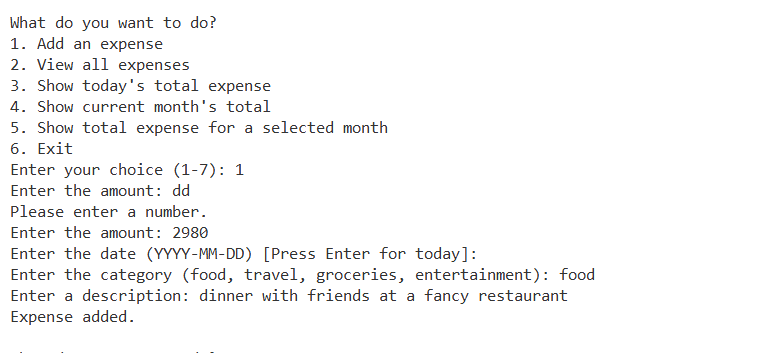
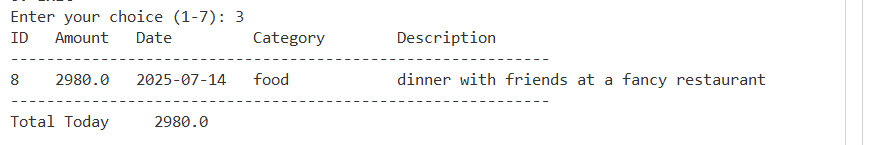

Expense Tracker (Python)
A simple command-line application for tracking your daily expenses. This app uses Python and SQLite to help you record, manage, and review expenses efficiently, with features to see totals for today, this month, or any specific month.

Features
Add expenses with amount, date, category, and description
View all expenses in a table format
See total expenses so far
Show today’s expenses and total
Show current month’s expenses and total
Show total expenses for any selected month
Four built-in categories: food, travel, groceries, entertainment

Tech Stack
Python 3
SQLite (sqlite3 module)
Standard libraries: datetime

How to Run
1. Clone this repository
2. Make sure you have Python 3 installed
3. Run the application (python main.py)
4. Follow the prompts in the terminal to add or review expenses
5. The database file (expenses.db) will be created automatically in the project folder.

Screenshots of how the app looks:

Possible Improvements
1. Add editing and deleting of expense entries
2. Allow custom categories
3. Export data to CSV or Excel
4. Add monthly or category-based reports
5. User authentication for multiple users

