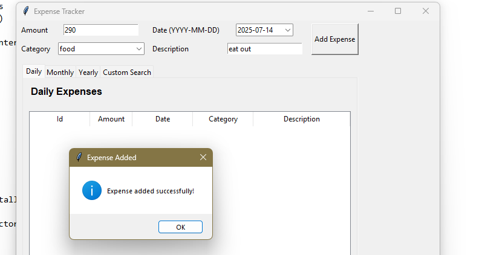

GUI Expense Tracker (Python, Tkinter)
A desktop application to record, view, and analyze personal expenses. Built with Python’s Tkinter for the user interface and SQLite for data storage. The app features multiple views (daily, monthly, yearly, and custom date range), input validation, and dynamic tables to make expense tracking easy and interactive.

Features
1. Add expenses with amount, date (calendar picker), category, and description
2. View expenses for today, this month, this year, or any custom date range (using tabs)
3. Tabular display of all expenses with auto-updating totals
4. Input validation and error handling (no bad data goes in)
5. Uses SQLite to store data locally
6. Simple, clean UI built with Tkinter’s Notebook (tabbed interface)

Tech Stack
Python 3
Tkinter (GUI)
SQLite (via sqlite3 module)
tkcalendar (for easy date picking)

How to Run
1. Clone or download this repository
2. Make sure you have Python 3 installed
3. Install dependencies (if not already available): pip install tkcalendar
4. Run the app: (python main.py)
The app will create an expenses.db file in the project directory if it doesn’t already exist.

Possible Future Improvements
1. Edit or delete existing expenses
2. Support custom user categories
3. Export data to CSV/Excel
4. Add charts or graphs for expense trends
5. User login for multi-user support

Screenshots

