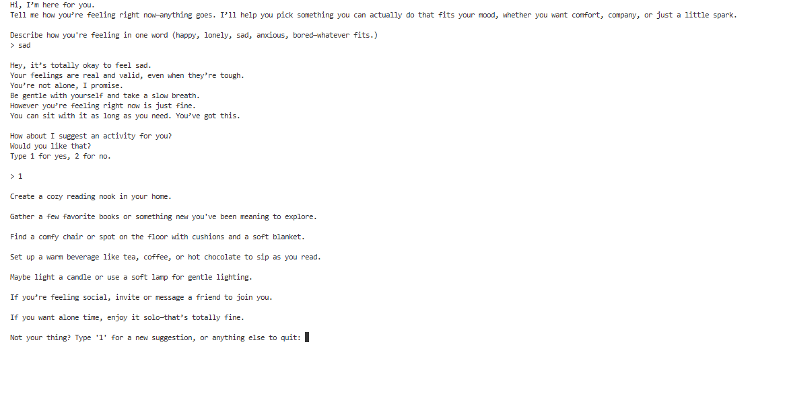
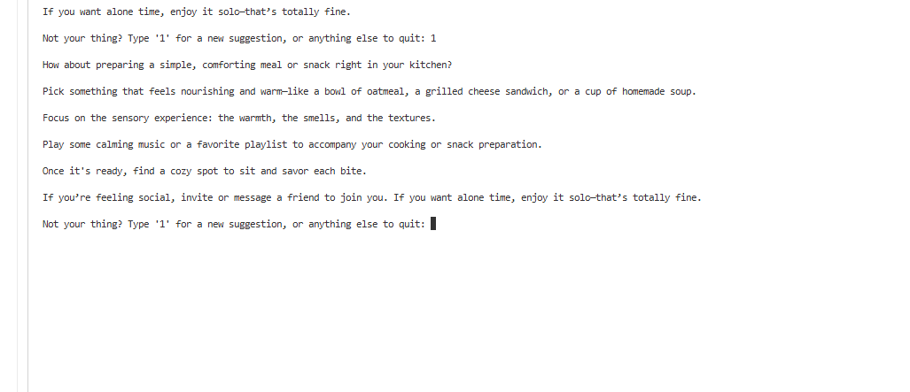

AI Mood-Based Activity Suggestion (Python, OpenAI, dotenv)
This is a command-line Python app that uses the OpenAI API to suggest practical activities tailored to your current emotion or mood. The app maps a wide range of feelings (both positive and negative) to specific needs, gives friendly support messages, and generates unique, safe activity ideas using GPT-4.

Features
1. Enter any emotion (happy, anxious, bored, hopeful, etc.) and get an understanding, supportive message
2. App maps emotions to underlying needs (comfort, socializing, rest, etc.)
3. Suggests realistic, safe activities using OpenAI GPT-4

Tech Stack
Python 3
openai (for accessing GPT-4)
python-dotenv (for environment variables)

Setup Instructions
1. Clone or download this repository.
2. Install the required Python packages:
pip install openai python-dotenv
3. Create a .env file in the project directory:
You can use the provided .env.example as a template.
Add your OpenAI API key:
OPENAI_API_KEY=your-openai-api-key-here
4. Run the script:
python main.py

.env.example
OPENAI_API_KEY=your-openai-api-key-here

Screenshots

