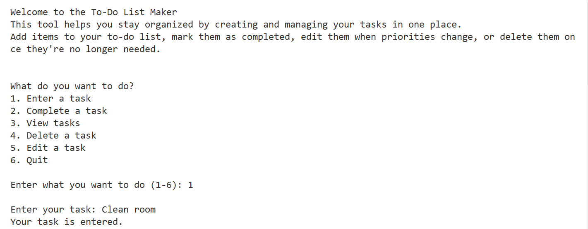
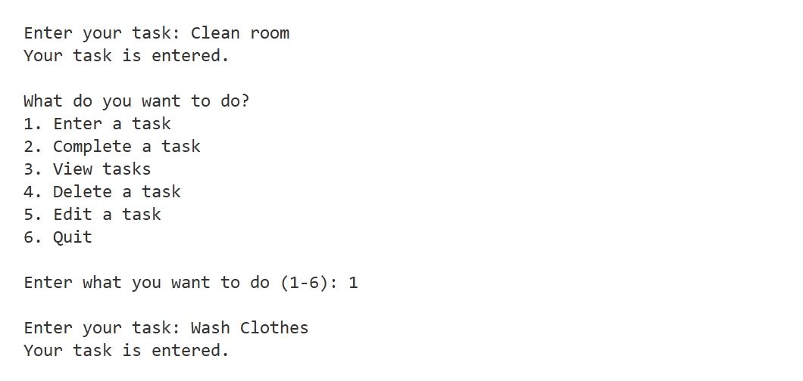
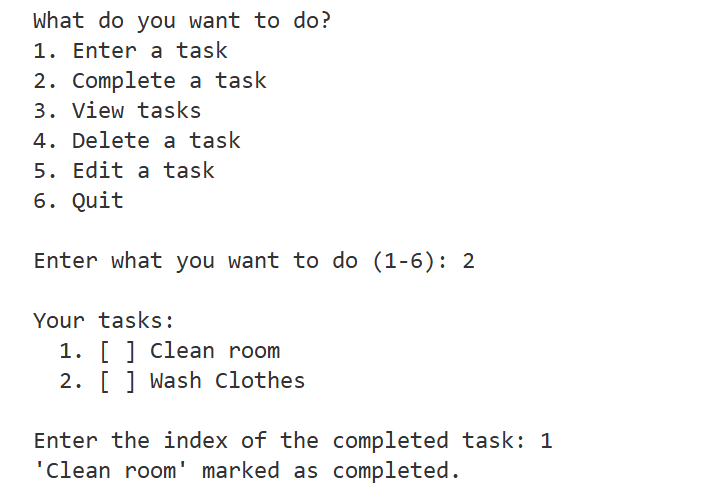
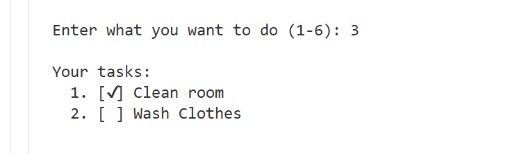
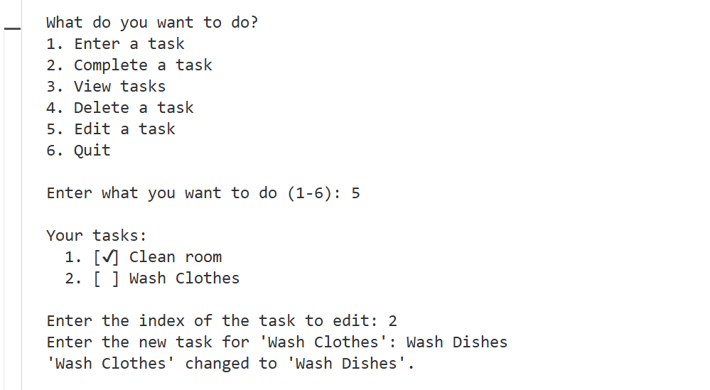
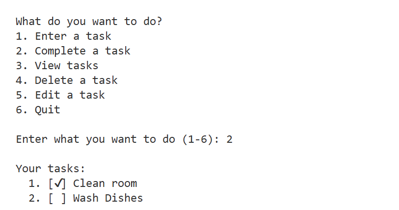

To-Do List CLI App (Python)
A simple command-line tool to create, manage, and organize your tasks efficiently.
Add, complete, edit, or delete tasks—all from your terminal.

Features
1. Add new tasks
2. Mark tasks as completed
3. Edit existing tasks
4. Delete tasks you no longer need
5. View your to-do list at any time
6. Visual indication for completed tasks

Tech Stack
Python 3 (no external dependencies)

How to Run
1. Download or clone this repository.
2. Make sure you have Python 3 installed.
3. Run the script:
python TodoList.py
Follow the on-screen prompts in your terminal.

Screenshots

