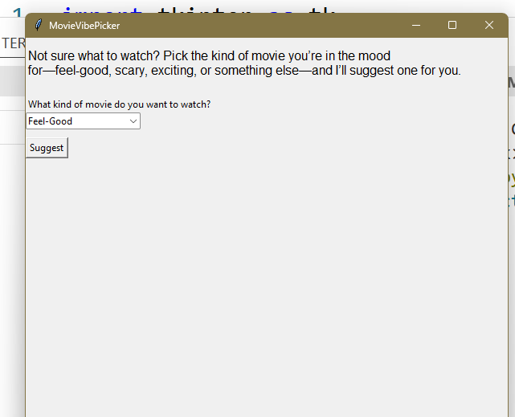
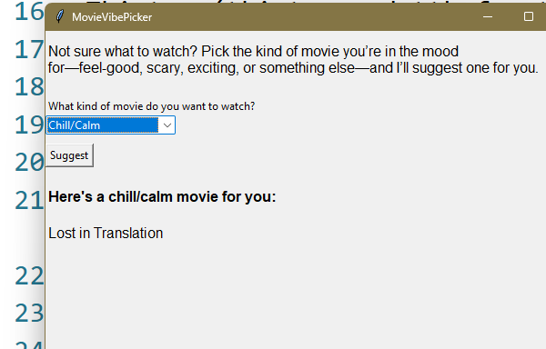

Movie Vibe Picker (Python, Tkinter)
A simple desktop app that recommends a movie based on your mood. Just pick the type of movie you’re in the mood for—feel-good, scary, thrilling, classic, and more—and Movie Vibe Picker will suggest something to watch.

Features

1. Easy-to-use graphical interface (built with Tkinter)
2. Drop-down menu for selecting mood/type of movie
3. Click “Suggest” to instantly get a movie recommendation
4. Covers a variety of moods: feel-good, tearjerker, comedy, classic, mind-bending, and more
5. Movie database is easily extendable

Tech Stack
Python 3
Tkinter (tkinter and ttk for the GUI)
random module (for picking movies)
No external dependencies required

How to Run

1. Make sure you have Python 3 installed (Tkinter comes with most Python distributions)
2. Download or clone this repository
3. Make sure both main.py and movie_data.py are in the same directory
4. Run the app:
   python main.py

Screenshots

